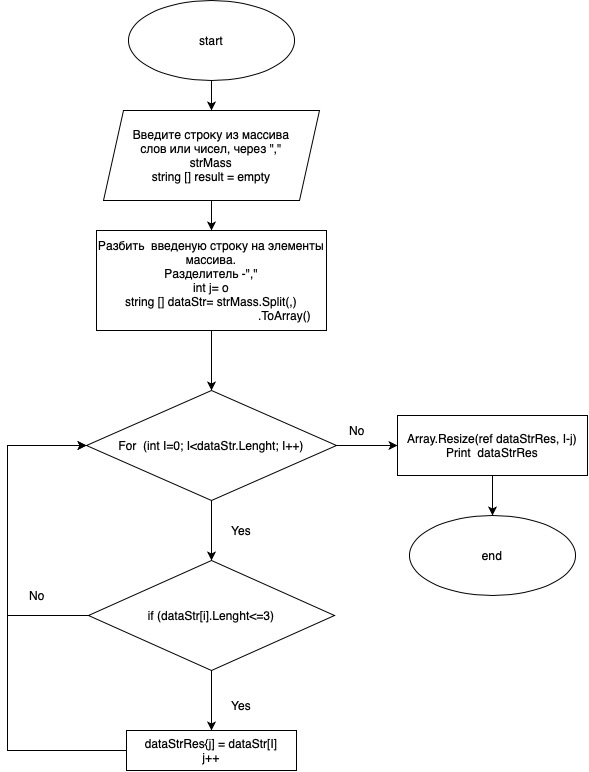

# **Инструкция для работы с ПРОГРАММОЙ**
Программа из имеющегося массива строк формирует массив строк, длинна которых меньше либо равна 3 символа. Первоначальный массив вводим с клавиатуры.
* Блок-схема:

** Описание элементов кода:**

* Метод ввода данных с консоли - ReadFromConsole

< string  ReadFromConsole (string mess) >

<{>

   <WriteLine (mess);>

    <return Convert.ToString(ReadLine());>

<}>

* Вызов метода ввода с консоли и ввод строки массива:

<string strMass = ReadFromConsole ("Введите массив чисел или символов через запятую");>

* Обьявляем массив dataStr и разбиваем строку массива на отдельные элементы массива, разделитель - ",":

<string[] dataStr = strMass.Split(',')
                           .ToArray();>

* Обьявляем массив dataStrRes для элементов сдлинной строки не более 3-х символов:

<string[] dataStrRes= new string [dataStr.Length];>

* Цикл с помощью которого перебираем массив dataStr и если длинна элемента менне либо равна 3 символам, то сохраняем его в итоговом массиве dataStrRes:

<for (i=0; i < dataStr.Length; i++)
{
    if (dataStr[i].Length<=3)
    {
        dataStrRes[j] = dataStr[i];
        j++;
    }
}>

* Переназначаем размерность массива dataStrRes:

<Array.Resize(ref dataStrRes, i-j);>

* Вывод результата:

<WriteLine ("Массив выражений не более 3-х символов: ");
for (i = 0; i < dataStrRes.Length; i++)
    {
    Write($"{dataStrRes[i]}, ");
    }  
WriteLine();>

